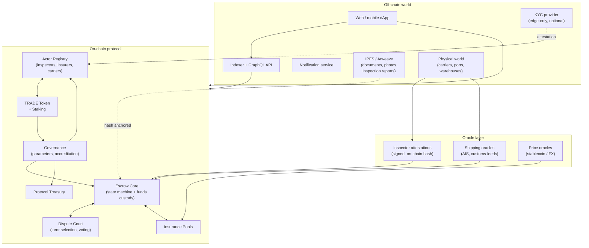
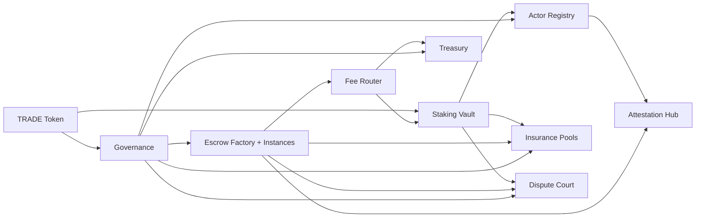

---
{"dg-publish":true,"permalink":"/docs/02-architecture/","title":"02 — System Architecture","tags":["trade-protocol","concept","architecture","contract"],"dg-note-properties":{"title":"02 — System Architecture","tags":["trade-protocol","concept","architecture","contract"],"up":"[[README|Index]]","prev":"[[01-vision]]","next":"[[docs/03-actors-roles\|03-actors-roles]]"}}
---

# 02 — System Architecture

## On-chain / off-chain split

## What lives where

| Concern | Location | Why |
|---|---|---|
| Funds custody | On-chain | Must be trustless, atomic, slashable |
| Trade state machine | On-chain | Disputes need a canonical record |
| Document content (BoL, invoices, photos) | IPFS/Arweave | Too large for chain, immutable refs only |
| Document hashes + signatures | On-chain | Tamper-evident anchoring |
| KYC artefacts | Off-chain (provider) | Privacy + regulatory; on-chain only an attestation |
| Indexed search & UI state | Indexer | UX, not consensus |
| Inspector reports | Off-chain content + on-chain attestation | Same as documents |
| Shipping events (vessel, container) | Off-chain feeds → oracle attestation | Source of truth is the carrier |

## Module topology

## Chain choice (open question)

The protocol is chain-agnostic in design but realistic candidates differ in
trade-offs:

- **Ethereum L1** — strongest settlement, expensive per-trade, fine for
  high-value international deals.
- **An EVM L2 (Arbitrum / Base / OP)** — ~100× cheaper, viable for mid-value
  trade, inherits Ethereum security.
- **An app-chain (Cosmos SDK / Polkadot parachain)** — full control over fee
  markets and governance, weaker security and bridge risk.

**Recommendation**: ship on a major EVM L2 first; settle high-value escrows to
L1 via cross-chain message if the trade size warrants the gas.

## Trust assumptions, summarised

The protocol is trustless about **funds** but trust-minimised, not trust-free,
about **physical reality**. We replace one trusted intermediary (the bank /
marketplace) with a layered, economically-incentivised set of attestors. The
honest behaviour of the *whole* set is what users trust, not any single actor.

---

**See also:** [[docs/06-smart-contracts\|06-smart-contracts]] · [[docs/09-oracles-inspection-insurance\|09-oracles-inspection-insurance]] · [[docs/03-actors-roles\|03-actors-roles]]
