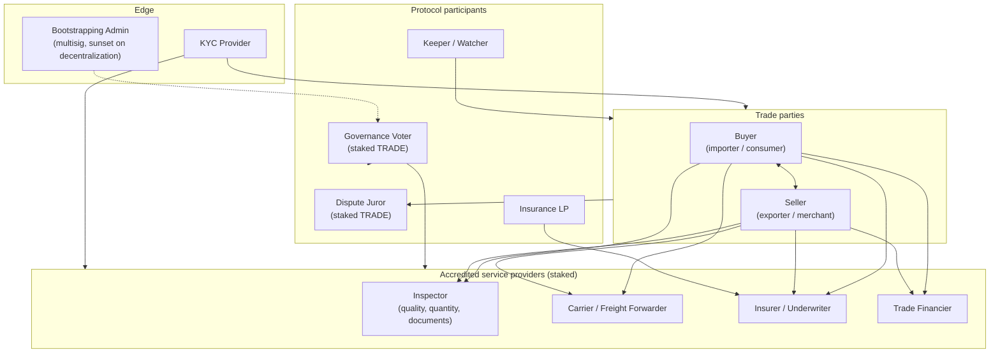

---
{"dg-publish":true,"permalink":"/docs/03-actors-roles/","title":"03 — Actors & Roles","tags":["trade-protocol","actor","tokenomics","governance"],"dg-note-properties":{"title":"03 — Actors & Roles","tags":["trade-protocol","actor","tokenomics","governance"],"up":"[[README|Index]]","prev":"[[02-architecture]]","next":"[[docs/04-workflows\|04-workflows]]"}}
---

# 03 — Actors & Roles

## Trade parties

### Buyer
- Opens or accepts a trade.
- Funds the escrow (in stablecoin).
- Confirms delivery; raises disputes.
- Optionally transfers their position (resale in transit).

### Seller
- Lists a good/service or accepts a buyer-initiated request.
- Ships, delivers, or performs.
- Submits proof-of-shipment / proof-of-delivery.
- Optionally posts a performance bond (slashable) for high-value or long-tail goods.

## Accredited service providers

All four roles below must be **registered** in the on-chain Actor Registry,
which requires:

1. A minimum stake of TRADE token (role-specific).
2. An off-chain accreditation review (governance-approved KYC/credential check).
3. Maintaining a reputation score derived from completed jobs and disputes.

A provider who acts in bad faith can be **slashed** (stake burned or
redistributed to harmed parties).

### Inspector
Independent third party verifying physical reality:
- Pre-shipment inspection (PSI)
- In-transit inspection (rare; e.g. transhipment surveys)
- Destination inspection
- Documentary inspection (CoO, phytosanitary, etc.)

Submits a signed attestation, content-hashed to IPFS, anchored on-chain. See [[docs/09-oracles-inspection-insurance\|09-oracles-inspection-insurance]].

### Carrier / Freight Forwarder
Optional on-platform role; many trades will reference an off-platform carrier
whose milestones are oracled in. When on-platform:
- Issues a digital bill of lading (eBL) bound to the escrow.
- Posts shipment events that release milestone payments.

### Insurer / Underwriter
Underwrites cargo or performance risk. Can be:
- A licensed external insurer routed through an adapter.
- An on-platform insurance pool funded by LPs.

### Trade Financier
Provides liquidity against an open escrow position — e.g. paying the seller
early in exchange for the buyer's eventual payment, at a discount. Implemented
as a transferable claim on the escrow.

## Protocol participants

### Dispute Juror
TRADE-stakers who opt into the Dispute Court. Selected by stake-weighted random
draw per case. Vote on evidence; coherent voters earn fees, incoherent voters
are slashed. See [[docs/08-dispute-resolution\|08-dispute-resolution]].

### Governance Voter
TRADE-stakers who vote on:
- Protocol parameters (fee rates, stake minima, jury sizes).
- Accreditation of service providers.
- Treasury allocations.
- Protocol upgrades.

### Insurance LP
Stakes capital (stablecoin) into insurance pools. Earns premiums; absorbs
claims. Pools are segmented by risk class.

### Keeper / Watcher
Permissionless role: anyone can call timeout / liquidation functions and
collect a small bounty. This decentralises the "cron" of the protocol.

## Edge / off-protocol

### KYC Provider
A regulated identity verifier; issues attestations consumed at registration.
Multiple providers can be accredited so users have choice.

### Bootstrapping Admin
A multisig (founders + reputable third parties) holding emergency pause and
parameter-set powers during the first ~12–24 months. Powers are progressively
migrated to governance per the roadmap.

## Stake & slashing summary

| Role | Stake | Slashing trigger |
|---|---|---|
| Inspector | Tier-based (USD-denominated min, paid in TRADE) | Provably false attestation |
| Carrier (on-platform) | Per-shipment bond | Lost/damaged cargo, false events |
| Insurer (LP) | Capital in pool | Claim payouts (not slashing per se) |
| Juror | TRADE in dispute pool | Voting against majority + evidence |
| Governance | TRADE in gov pool | Malicious-proposal slashing (rare, high bar) |
| Seller (optional, high-value) | Performance bond | Non-delivery or proven defect |

---

**See also:** [[docs/07-tokenomics\|07-tokenomics]] · [[docs/08-dispute-resolution\|08-dispute-resolution]] · [[docs/04-workflows\|04-workflows]]
