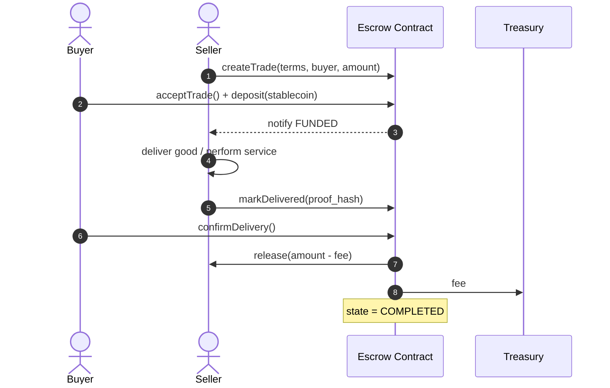
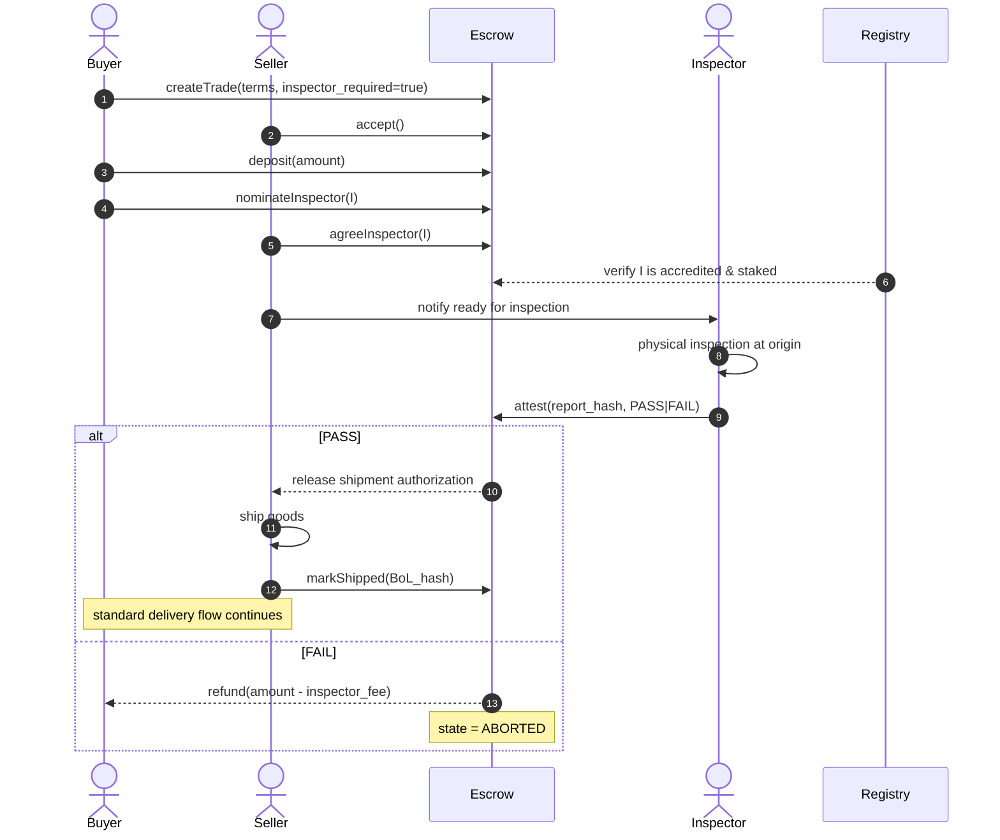
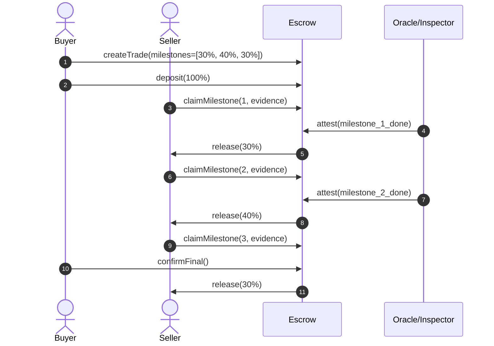
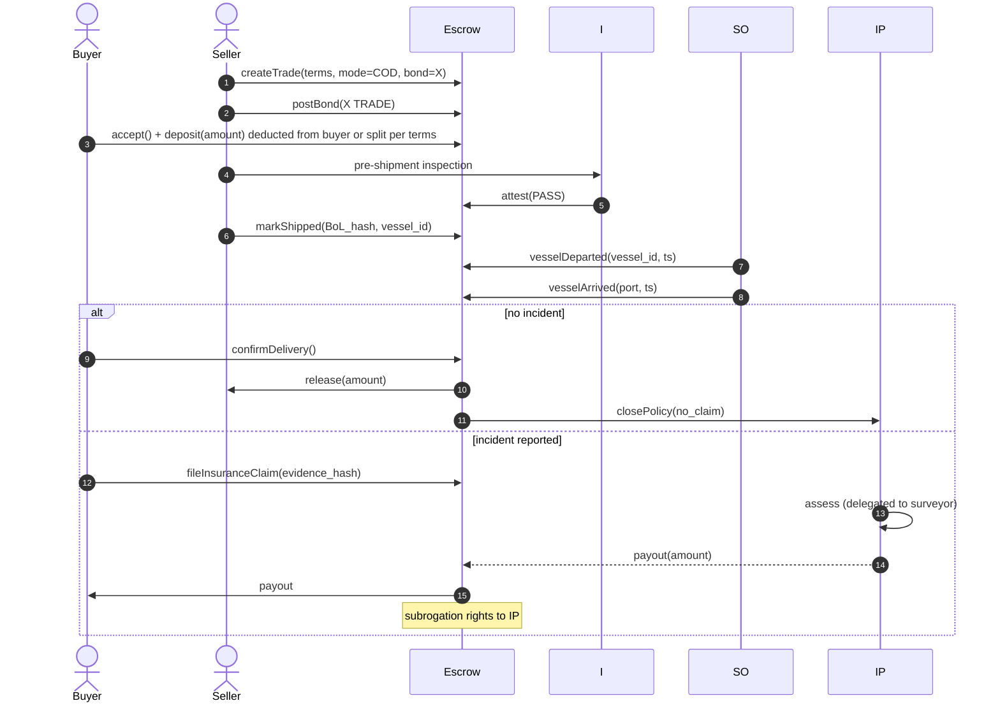
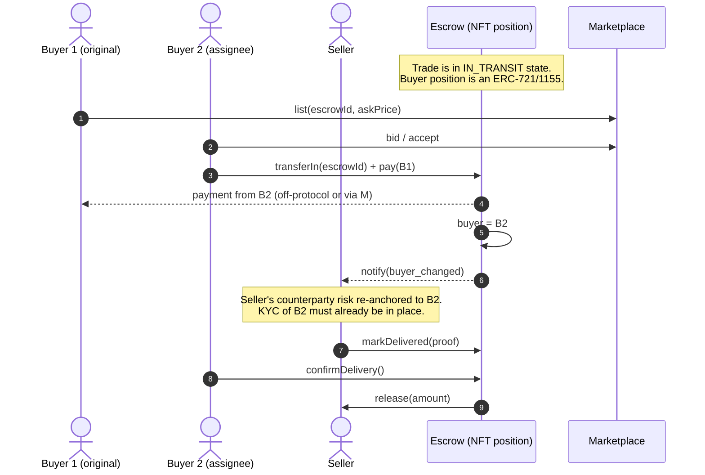
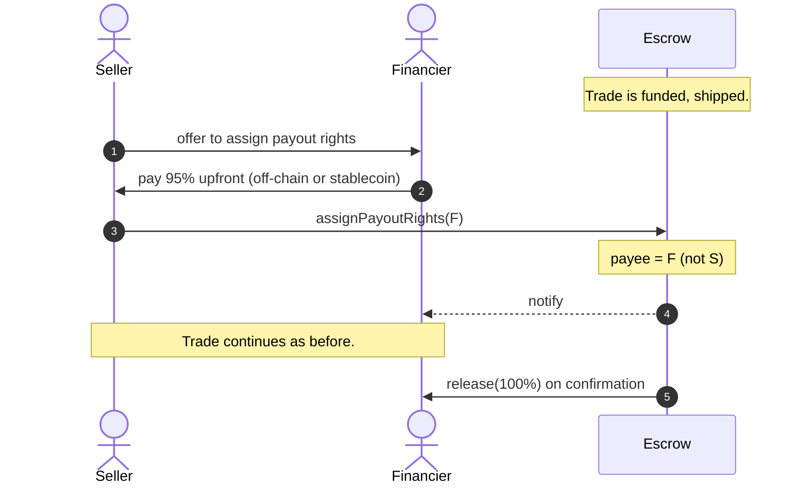

---
{"dg-publish":true,"permalink":"/docs/04-workflows/","title":"04 — Commerce Workflows","tags":["trade-protocol","workflow","concept"],"dg-note-properties":{"title":"04 — Commerce Workflows","tags":["trade-protocol","workflow","concept"],"up":"[[README|Index]]","prev":"[[03-actors-roles]]","next":"[[docs/05-state-machine\|05-state-machine]]"}}
---

# 04 — Commerce Workflows

This document walks through the canonical trade flows the protocol supports,
each illustrated with a sequence diagram. They are presented in order of
increasing complexity. All build on the core state machine in [[docs/05-state-machine\|05-state-machine]].

## 4.1 — Vanilla escrow (MVP)

Use case: a freelance design job, a P2P used-laptop sale, any low-complexity trade.

**Failure paths**: buyer never confirms → seller calls `claimTimeout` after
N days → if no dispute filed, funds release. Either party can `dispute` before
confirmation (see [[docs/08-dispute-resolution\|08-dispute-resolution]]).

## 4.2 — Prepayment with pre-shipment inspection (PSI)

Use case: importing 10,000 units of a manufactured good. Buyer wants
verification before goods leave origin.

## 4.3 — Milestone payments (multi-stage)

Use case: a long manufacturing run or a multi-leg shipment.

Milestones can be tied to: deposit at factory, BoL issuance, vessel sailing
(AIS oracle), arrival at port, customs clearance, final delivery.

## 4.4 — Buyer-funded escrow with seller bond (quasi-COD)

Use case: buyer refuses to prepay; seller posts a slashable performance bond
to assure they will not extort post-delivery.

## 4.6 — Transferable escrow / in-flight resale

Use case: B1 bought a cargo of crude oil at $80/bbl; while it sails, the spot
price moves to $90 and B1 wants to flip it to B2.

Key constraint: seller's interests must be preserved. Transfer is allowed only
if (a) the new buyer passes KYC tier ≥ original, (b) escrow is fully funded
(it is — funds were deposited at trade open), and (c) any insurance policy
follows the position.

## 4.7 — Trade finance / factoring

Use case: seller wants cash now; financier pays seller 95% today, collects
100% from escrow on delivery.

The seller-position can also be tokenised as an NFT, opening the door to
secondary markets and pooled financing — out of scope for the v1 design but
the interfaces should not preclude it.

## Workflow composition

These workflows are not exclusive — a single trade can be:

> *prepaid + PSI-inspected + insured + milestoned + transferable + financed.*

The state machine in [[docs/05-state-machine\|05-state-machine]] is the single canonical flow; each
module is a **hook** that attaches at predefined extension points (`FUNDED`,
`SHIPPING`, `IN_TRANSIT`, `DELIVERED`, `DISPUTED`, `COMPLETED`, `ABORTED`).

---

**See also:** [[docs/05-state-machine\|05-state-machine]] · [[docs/06-smart-contracts\|06-smart-contracts]] · [[docs/09-oracles-inspection-insurance\|09-oracles-inspection-insurance]]
