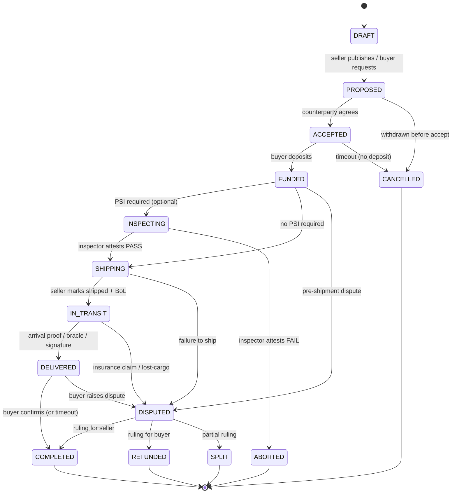
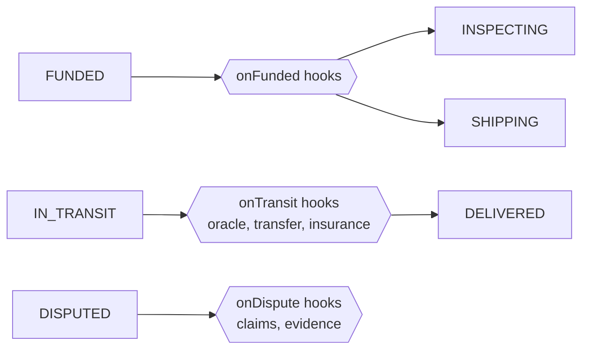

---
{"dg-publish":true,"permalink":"/docs/05-state-machine/","title":"05 — Escrow State Machine","tags":["trade-protocol","concept","contract","workflow"],"dg-note-properties":{"title":"05 — Escrow State Machine","tags":["trade-protocol","concept","contract","workflow"],"up":"[[README|Index]]","prev":"[[docs/04-workflows\|04-workflows]]","next":"[[docs/06-smart-contracts\|06-smart-contracts]]"}}
---

# 05 — Escrow State Machine

A single canonical state machine governs every trade. Optional modules
(inspection, insurance, milestones, transfer) are **hooks** at predefined
states — they enrich a transition without forking the machine.

> [!tip] Companion docs
> Workflows that exercise this machine: [[docs/04-workflows\|04-workflows]]. Implementation surface: [[docs/06-smart-contracts\|06-smart-contracts]].

## Canonical states

## States in plain words

| State | Funds | Meaning |
|---|---|---|
| `DRAFT` | none | One side is composing terms; not yet visible to the other. |
| `PROPOSED` | none | Counterparty can accept; either side can withdraw. |
| `ACCEPTED` | none | Both sides committed; awaiting buyer deposit. |
| `FUNDED` | escrowed | Buyer has paid in. Seller can begin work / shipment. |
| `INSPECTING` | escrowed | Pre-shipment inspector is verifying. |
| `SHIPPING` | escrowed | Seller is preparing/handing off to carrier. |
| `IN_TRANSIT` | escrowed | Goods are on the move; oracle events accepted here. |
| `DELIVERED` | escrowed | Carrier/oracle/buyer signals arrival. Confirmation window opens. |
| `COMPLETED` | released to seller | Terminal happy path. |
| `DISPUTED` | locked | Court has jurisdiction; no party can move funds. |
| `REFUNDED` | returned to buyer | Terminal: ruling favored buyer. |
| `SPLIT` | partial each way | Terminal: ruling apportioned. |
| `ABORTED` | refunded minus inspector fee | Terminal: failed PSI. |
| `CANCELLED` | none / fully refunded | Terminal: withdrawn pre-funding or pre-shipping. |

## Transitions and authority

Every transition encodes **who** can fire it and **under what evidence**.

| From → To | Caller | Evidence / condition |
|---|---|---|
| `DRAFT → PROPOSED` | author | none |
| `PROPOSED → ACCEPTED` | counterparty | signed accept |
| `PROPOSED → CANCELLED` | author or counterparty | before accept |
| `ACCEPTED → FUNDED` | buyer | stablecoin transfer |
| `ACCEPTED → CANCELLED` | keeper | timeout elapsed |
| `FUNDED → INSPECTING` | seller | terms include PSI |
| `INSPECTING → SHIPPING` | inspector | signed PASS attestation |
| `INSPECTING → ABORTED` | inspector | signed FAIL attestation |
| `FUNDED → SHIPPING` | seller | no PSI required |
| `SHIPPING → IN_TRANSIT` | seller | BoL hash + carrier ref |
| `IN_TRANSIT → DELIVERED` | buyer / carrier oracle / inspector | proof of delivery |
| `DELIVERED → COMPLETED` | buyer (or keeper after timeout) | confirmation or expiry |
| `* → DISPUTED` | buyer or seller | bond posted, evidence hash (see [[docs/08-dispute-resolution\|08-dispute-resolution]]) |
| `IN_TRANSIT → DISPUTED` | buyer, seller, *or* insurance pool | loss / non-arrival event; pool may file when subrogated under an active policy |
| `DISPUTED → COMPLETED/REFUNDED/SPLIT` | Dispute Court | final ruling (see [[docs/08-dispute-resolution\|08-dispute-resolution]]) |

## Timeouts

Each state has a configurable maximum dwell time, set per-trade at creation
within governance-bounded ranges:

| State | Default max | Effect on expiry |
|---|---|---|
| `PROPOSED` | 7 d | auto-cancel |
| `ACCEPTED` | 3 d | auto-cancel |
| `INSPECTING` | 14 d | auto-dispute |
| `SHIPPING` | 30 d | auto-dispute |
| `IN_TRANSIT` | trade-specific (e.g. 60 d sea freight) | auto-dispute |
| `DELIVERED` | 7 d | auto-complete (release to seller) |
| `DISPUTED` | court-defined | extends until ruling |

Timeouts are fired by **keepers** for a small TRADE bounty, paid by the
losing/timing-out party.

## Hook points (for optional modules)

Modules registered at `onFunded` (e.g. insurance binding, financing handoff)
run atomically as part of the state transition. A failing hook reverts the
transition.

## Invariants

1. **Funds conservation.** Sum of `(escrowed + released + refunded + fees +
   inspector_fee)` is constant once `FUNDED` is reached. The `inspector_fee`
   term is non-zero only on the `ABORTED` terminal (paid out of escrow on
   failed PSI); on all other paths it is zero.
2. **Single terminal.** Once a trade is in `{COMPLETED, REFUNDED, SPLIT,
   ABORTED, CANCELLED}`, no further transitions.
3. **Disputed lock.** No funds movement in `DISPUTED` except by court ruling.
4. **Evidence anchoring.** Every transition that depends on real-world fact
   carries an on-chain hash of the supporting document.

---

**See also:** [[docs/04-workflows\|04-workflows]] · [[docs/06-smart-contracts\|06-smart-contracts]] · [[docs/08-dispute-resolution\|08-dispute-resolution]]
