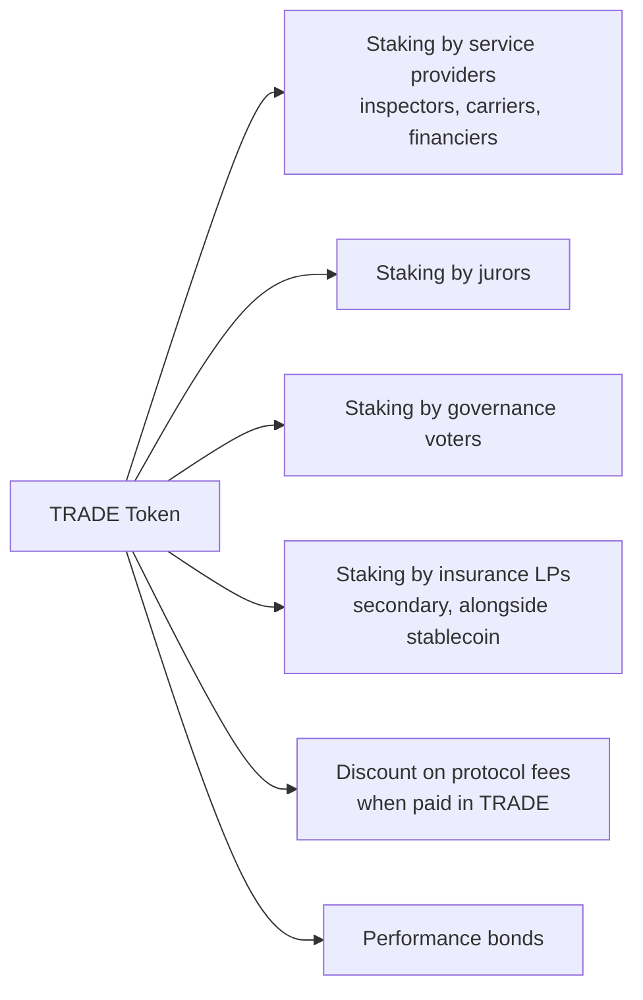
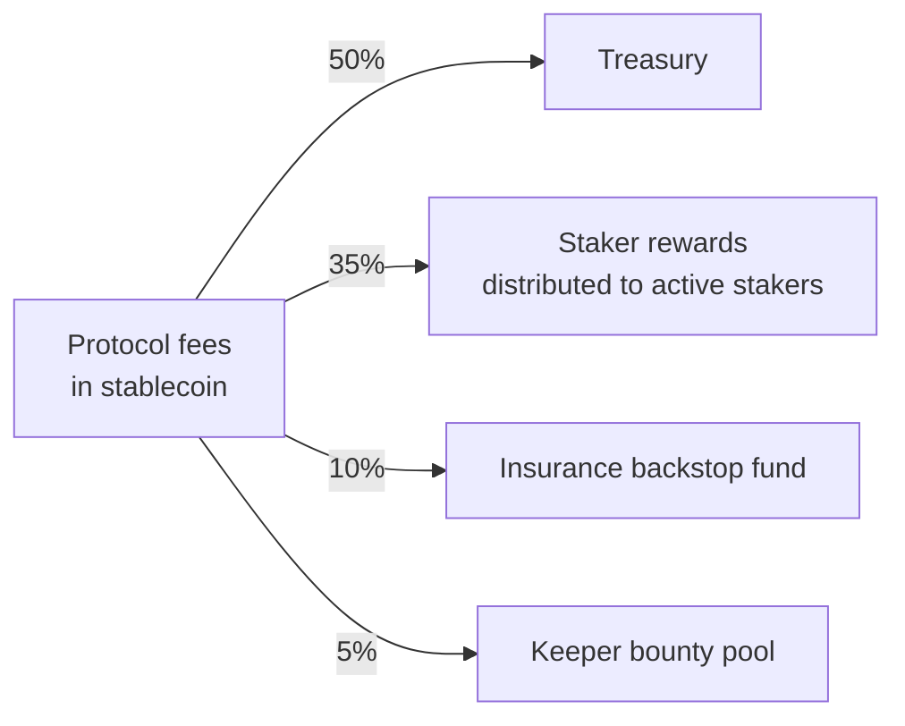

---
{"dg-publish":true,"permalink":"/docs/07-tokenomics/","title":"07 — Tokenomics & Staking","tags":["trade-protocol","tokenomics","governance","contract"],"dg-note-properties":{"title":"07 — Tokenomics & Staking","tags":["trade-protocol","tokenomics","governance","contract"],"up":"[[README|Index]]","prev":"[[docs/06-smart-contracts\|06-smart-contracts]]","next":"[[docs/08-dispute-resolution\|08-dispute-resolution]]"}}
---

# 07 — Tokenomics & Staking

The protocol uses **two** tokens, conceptually:

1. **Settlement currency** — an external stablecoin (USDC, EURC, etc.). All
   trade value flows in stablecoin. The protocol does **not** issue this.
2. **TRADE** — the native protocol token. Utility + governance + skin-in-the-game.

This split keeps merchants away from native-token volatility while still
letting the protocol create credible economic alignment for its participants.

## TRADE token at a glance

| Property | Value |
|---|---|
| Standard | ERC-20 |
| Supply | Capped, e.g. 1,000,000,000 TRADE |
| Issuance | Mint at genesis; emissions schedule for staking rewards (see below) |
| Transferable | Yes |
| Fee-on-transfer | No |
| Inflation | Bounded, set by governance within a hard ceiling |

## What TRADE is used for

It is **not** used:
- as the settlement currency for trades;
- as a payment for inspectors/carriers (they are paid in stablecoin);
- as a store of value the protocol promises to support (no buybacks promised).

## Allocation (illustrative)

| Bucket | % | Vesting |
|---|---|---|
| Community / staking emissions | 40% | Linear over 8 years |
| Treasury (governance-controlled) | 20% | Unlocked, spent via Governor |
| Team & early contributors | 18% | 1y cliff, 4y linear |
| Investors | 15% | 1y cliff, 3y linear |
| Liquidity & market-making | 4% | At launch |
| Public / fair launch | 3% | At launch |

These are placeholders to argue about. The principles that matter:

- **Community share ≥ team + investors combined**, otherwise governance is
  captured.
- **Long vesting** for insiders. Anything < 4 years is a red flag for a
  protocol that wants to live a long time.
- **Treasury exists**. Without it the protocol cannot pay for audits, oracle
  costs, grants, or run insurance backstops.

## Emissions

Two-pool emission model from the community bucket:

1. **Service-provider rewards** — paid to inspectors, carriers, financiers
   who complete jobs without slashing events. Funded as a per-trade subsidy
   that decays over time as fee revenue grows.
2. **Juror & governance rewards** — paid to coherent jurors and active
   governance voters.

Emissions taper on a fixed schedule and converge to **fees, not emissions**,
as the long-run incentive. A protocol that needs to print forever is not
sustainable.

## Fee model

Per-trade protocol fee, expressed in basis points of trade value, charged in
the settlement stablecoin:

| Tier | Fee (bps) | Notes |
|---|---|---|
| Trade < $1k | 100 (1.0%) | Higher to cover fixed gas |
| $1k – $100k | 50 (0.5%) | Standard |
| > $100k | 25 (0.25%) | Whale discount; absolute fee still large |
| Disputed | + 50 bps | Charged to losing party |

Discount: pay in TRADE → 25–50% off, parameter under governance. This creates
a non-coercive sink for the token without forcing merchants to hold it.

### Fee distribution

Burning is intentionally absent in v1. Burns are seductive but they take
runway away from the treasury. Governance can later vote to burn a fraction
once the treasury is well-capitalised.

## Staking and slashing parameters

| Stake stream | Min stake | Cooldown | Max slash | Slashing condition |
|---|---|---|---|---|
| Inspector | tier-based, denominated in $ TRADE-equivalent | 14 d | 100% of bond | Provably false attestation (court ruling) |
| Carrier | per-shipment bond | 14 d | 100% of bond | Lost / damaged cargo, false events |
| Insurance LP | none (capital is the stake) | per-pool epoch | claim payouts | Not slashing, claims |
| Juror | TRADE in juror pool | 14 d | 5–20% per dispute lost coherence | Voted against majority + appellate ruling |
| Governance | TRADE in gov pool | 28 d | 0 default; 50% on malicious-proposal slashing | Approved by supermajority counter-proposal |
| Seller bond (optional) | trade-specific | atomic to trade | 100% | Non-delivery / proven defect |

Slashed funds split:
- **Harmed party** receives compensation up to their loss.
- **Surplus** (if any) goes to the **insurance backstop** and **treasury**.

## Why this design holds together

- Service providers gain reputation slowly and lose it quickly: stake +
  reputation + fee flow > expected gain from defection.
- Jurors are paid for *coherent* votes, not specific votes — Schelling-point
  honest voting is the dominant strategy when evidence is clear.
- LPs are paid premiums for risk; pool segmentation prevents one bad class
  from contaminating others.
- Token holders pay for the system through governance work and earn from fees,
  not from emissions in steady state.

## Open questions for governance

1. Should the protocol *require* trades above some threshold to use insurance,
   or remain fully opt-in?
2. Should TRADE-denominated bonds carry a floor (re-marked to $ at trade open
   to prevent token-price collapse from undercutting protections)?
3. Veto-token model (separate small-supply token for emergency vetoes) or
   single-token governance?

---

**See also:** [[docs/03-actors-roles\|03-actors-roles]] · [[docs/06-smart-contracts\|06-smart-contracts]] · [[docs/08-dispute-resolution\|08-dispute-resolution]] · [[docs/10-roadmap\|10-roadmap]]
