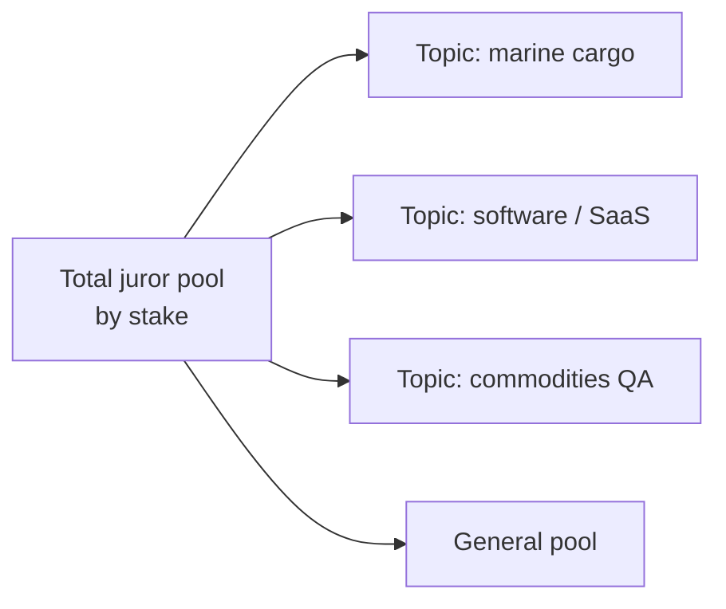
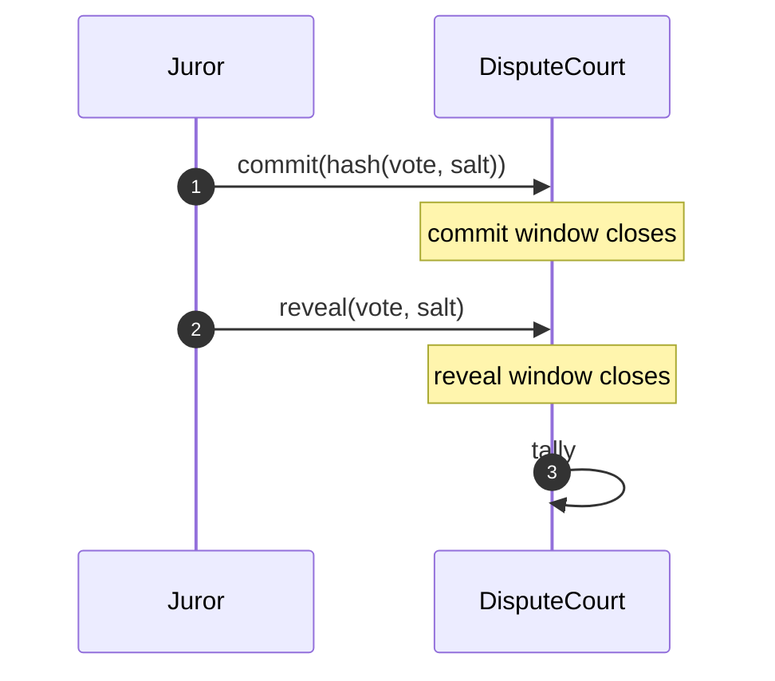

---
{"dg-publish":true,"permalink":"/docs/08-dispute-resolution/","title":"08 — Decentralized Dispute Resolution","tags":["trade-protocol","governance","contract","workflow"],"dg-note-properties":{"title":"08 — Decentralized Dispute Resolution","tags":["trade-protocol","governance","contract","workflow"],"up":"[[README|Index]]","prev":"[[docs/07-tokenomics\|07-tokenomics]]","next":"[[docs/09-oracles-inspection-insurance\|09-oracles-inspection-insurance]]"}}
---


# 08 — Decentralized Dispute Resolution

When a trade enters `DISPUTED`, jurisdiction passes to the on-chain Dispute
Court. The design draws on Kleros / SchellingCoin: stake-weighted random
juror selection, commit-reveal voting, and slashing for incoherent votes.

## High-level flow

```mermaid
flowchart TB
  FILE[Party files dispute<br/>+ evidence hash + bond]
  ROUND1[Round 1 jury drawn<br/>(stake-weighted RNG)]
  EVID[Evidence period<br/>both parties + accredited witnesses]
  COMMIT[Commit phase<br/>jurors hash their vote]
  REVEAL[Reveal phase<br/>jurors reveal]
  TALLY[Tally]
  RULE{Ruling}
  EXEC[Execute on Escrow<br/>release / refund / split]
  SLASH[Slash incoherent jurors<br/>reward coherent jurors]
  APPEAL{Appeal filed?}
  ROUND2[Larger jury drawn]

  FILE --> ROUND1 --> EVID --> COMMIT --> REVEAL --> TALLY --> RULE
  RULE --> APPEAL
  APPEAL -- yes --> ROUND2 --> EVID
  APPEAL -- no --> EXEC --> SLASH
```

## Filing a dispute

A party (buyer or seller) calls `dispute(escrowId, evidenceHash)` with a
**dispute bond** in TRADE. The bond:

- discourages frivolous disputes;
- is forfeit (in part) by the losing party;
- scales with the trade value (e.g. 1–5% of trade value, capped).

Disputes can be filed from any non-terminal state after `FUNDED`, but with
different evidentiary frames (pre-shipment dispute vs. delivery dispute vs.
post-delivery defect claim).

## Juror selection

Jurors are drawn from the **juror staking pool**. Selection is:

- **Stake-weighted**: probability of being drawn ∝ TRADE staked.
- **Random**: VRF-based draw (e.g. via Chainlink VRF or chain-native randomness).
- **Sized to round**: round 1 = 5 jurors; appeal rounds double, capped (5 → 11 → 23 → 47).
- **Specialised pools (optional)**: for technical disputes (e.g. commodity
  quality, IT services), sub-pools with credentialed jurors stake into a
  topic-tagged pool. Round 1 draws from the topic pool; appeals draw from the
  general pool.



## Evidence

- Each side may submit one or more **evidence bundles** during the evidence
  window (e.g. 7 days, parameterised). Each is a content-hash pinned to IPFS
  /Arweave; the contract stores the hash and submitter.
- **Witnesses**: accredited inspectors / carriers tied to the trade can submit
  attestations into the dispute record.
- **Cross-examination**: each side may submit one rebuttal bundle.
- All evidence is public to jurors; jurors cannot communicate with parties
  off-protocol (enforced socially / by reputation, not technically).

## Voting (commit-reveal)



Vote options:
- `RELEASE` (seller wins, full)
- `REFUND` (buyer wins, full)
- `SPLIT_xx` (e.g. SPLIT_50, SPLIT_70_30) — limited preset granularity to
  keep coherence well-defined.
- `ABSTAIN` — counted toward quorum, no impact on outcome, no reward, no
  slash.

Jurors who fail to reveal are slashed for their committed stake-share (they
disrupted the process).

## Tally and coherence

The **plurality** outcome wins (`SPLIT_xx` buckets mean a strict majority is
not guaranteed). Jurors voting for the winning bucket — or, for `SPLIT_xx`
votes, those within one bucket of the winning split — are **coherent**.
Coherence is therefore measured as **distance** on a single seller-share axis
(`REFUND` = 0%, `SPLIT_30_70` = 30%, `SPLIT_50` = 50%, `SPLIT_70_30` = 70%,
`RELEASE` = 100%), not as exact-match. `ABSTAIN` votes count toward quorum
only.

Coherent jurors are paid:
- a share of the dispute fee + losing party's bond;
- a share of slashed-from-incoherent-jurors stake.

Jurors outside the coherent band lose a fraction of their staked share,
proportional to how far their vote was from the winning bucket on the same
seller-share axis. This makes honest Schelling-point voting the dominant
strategy when the evidence is clear.

## Appeals

The losing party may appeal within an appeal window by posting an **appeal
bond** (≥ original bond × 2). A new, larger jury is drawn from a different
pool; the prior round's votes are not visible to them.

- Appeal bonds compound; this prices out frivolous appeals while preserving
  due process for genuinely contested rulings.
- A configurable maximum number of appeal rounds (e.g. 3) prevents infinite
  escalation; the last round's ruling is final.

## Final ruling and execution

The ruling is a transition on the escrow:
- `RELEASE` → `COMPLETED` (seller paid).
- `REFUND` → `REFUNDED` (buyer refunded).
- `SPLIT_xx` → `SPLIT` with the split ratio applied.

Bonds:
- Winning party recovers their bond minus a small protocol fee.
- Losing party's bond goes to: jurors (coherent share), winning party
  (compensation), treasury.

## Edge cases

- **Tied vote** → defaults to status quo (seller keeps shipping rights / buyer
  keeps escrow), with automatic appeal funded by treasury (rare).
- **Inspector found liable** by ruling → independent slashing event on the
  inspector's stake, funds flow to the harmed party.
- **Insurance interaction** — if a payout has already been made by an
  insurance pool, the pool acquires subrogation rights and is the party of
  record in the dispute.
- **Force majeure** — explicit ruling option `FORCE_MAJEURE` returns funds
  per terms (typically buyer-refund minus paid premiums and irrecoverable
  costs); no slashing.

## Why this works

1. **Skin in the game** for jurors via slashable stake.
2. **Random selection** prevents bribery of a specific juror set in advance.
3. **Commit-reveal** prevents bandwagon voting.
4. **Appeals** allow correction of bad rounds at increasing cost.
5. **Topic pools** keep technical disputes in front of competent jurors
   without sacrificing the appellate generality.

---

**See also:** [[docs/05-state-machine\|05-state-machine]] · [[docs/07-tokenomics\|07-tokenomics]] · [[docs/09-oracles-inspection-insurance\|09-oracles-inspection-insurance]]
