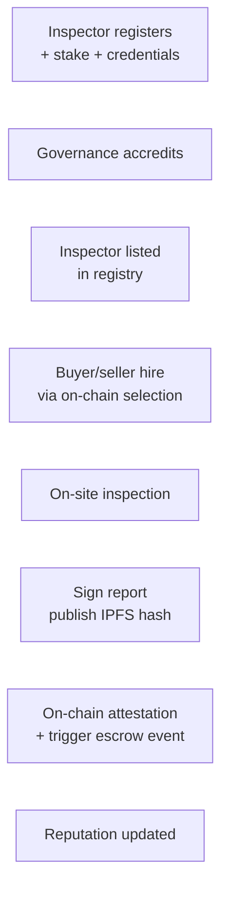
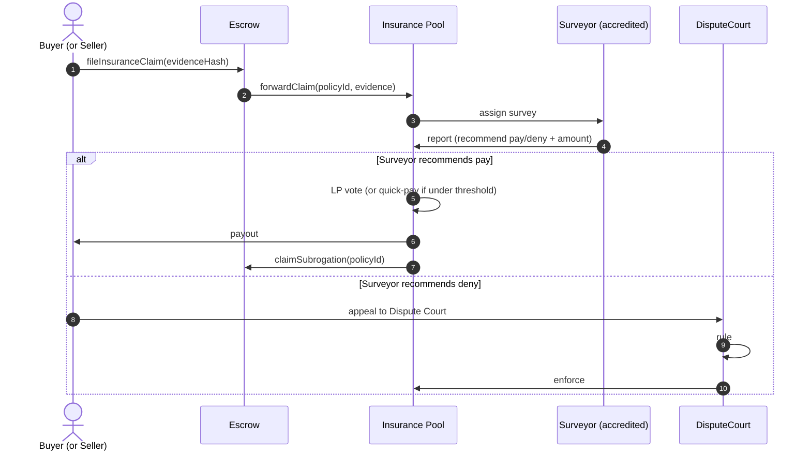

---
{"dg-publish":true,"permalink":"/docs/09-oracles-inspection-insurance/","title":"09 — Oracles, Inspection & Insurance","tags":["trade-protocol","actor","contract","workflow"],"dg-note-properties":{"title":"09 — Oracles, Inspection & Insurance","tags":["trade-protocol","actor","contract","workflow"],"up":"[[README|Index]]","prev":"[[docs/08-dispute-resolution\|08-dispute-resolution]]","next":"[[10-roadmap]]"}}
---


# 09 — Oracles, Inspection & Insurance

The protocol's hardest job is making **physical reality** legible to a smart
contract. This doc covers the three bridges that do it.

## 9.1 — Inspectors

Inspectors are **human attestors** with skin in the game. They visit a
warehouse, port, or facility and sign a structured attestation.

### Lifecycle



### Attestation schema (illustrative)

```
{
  "schema": "tradeprotocol/inspection/v1",
  "escrowId": "0x...",
  "inspectorId": "0x...",
  "type": "PSI" | "IN_TRANSIT" | "DESTINATION" | "DOCUMENTARY",
  "result": "PASS" | "FAIL" | "PARTIAL",
  "scope": { "qty_inspected": ..., "qty_total": ..., "criteria": [...] },
  "findings": [ ... ],
  "media": [ "ipfs://..." ],
  "timestamp": ...,
  "location": { "geo": ..., "facility": ... },
  "signature": "0x..."
}
```

The on-chain hash anchors the IPFS-pinned report. Jurors and other parties
can fetch and verify the signature against the registry.

### Selection mechanisms

Three modes, configurable per trade:

1. **Mutual choice** — both parties pick from the registry; default for high-trust trades.
2. **Random from a tier** — buyer specifies tier and topic, contract draws
   randomly from accredited inspectors in that tier (cuts collusion).
3. **Two-of-three** — each party nominates one, contract draws a third
   randomly; majority of attestations rules.

### Slashing inspectors

Triggered by:
- A dispute ruling that finds the inspector's attestation materially false.
- Cross-attestation contradiction (a later inspector or destination event
  contradicts the report, with court confirmation).

Slashed amount goes to: harmed party, then insurance backstop, then treasury.

## 9.2 — Shipping & event oracles

Many state transitions depend on logistics events: vessel sailed, vessel
arrived, container scanned at port, customs cleared.

### Sources

| Event class | Source | Trust model |
|---|---|---|
| Vessel position / port call | AIS feeds (e.g. MarineTraffic, port APIs) | Multi-source consensus |
| Air freight | Carrier APIs (IATA tracking) | Single-source + carrier signature |
| Container scans | Carrier eBL / Tradelens-like systems | Carrier signature |
| Customs clearance | Customs broker attestation | Accredited broker (registry) |

### Adapter pattern

```mermaid
flowchart LR
  FEED[External data feed]
  ADAPT[Oracle Adapter<br/>(per source)]
  HUB[AttestationHub]
  ESC[EscrowInstance]

  FEED --> ADAPT --> HUB --> ESC
```

Adapters are themselves on-chain contracts, accredited by governance. They:
- pull or accept pushed data;
- normalise to the protocol event schema;
- post signed attestations referencing the trade and source.

### Multi-source consensus

For high-value trades, the contract can require **K-of-N** sources to agree
on an event before the state transition fires. This is parameterised per
trade.

## 9.3 — Insurance

Insurance pools transform real-world risk into pooled, on-chain capital.

### Pool structure

One pool per **risk class**. A pool has:

- A **risk model** (parameters: max policy size, reserve ratio, premium curve).
- A **capital base** (LP stablecoin deposits).
- A **claims surveyor** (an accredited actor with authority to recommend
  payout; LP-vote or court-vote ratifies).
- A **reinsurance backstop** to the protocol-wide insurance fund.

```mermaid
flowchart TB
  LP[Insurance LPs] --> CAP[Pool capital]
  PREM[Premiums in] --> CAP
  CAP --> PAY[Claim payouts]
  CAP --> YIELD[Idle capital yield<br/>(blue-chip stables)]
  CAP --> REIN[Reinsurance to<br/>protocol backstop]
  POL[Policies bound<br/>to escrows] --> PREM
```

### Binding a policy

At trade creation (or later, before shipment), the escrow asks the pool to
quote a policy: value, duration, route, cargo class. The pool returns a
premium (or refuses). Premium is escrowed and paid to the pool on policy
activation.

### Claims



### Reinsurance & backstop

A protocol-level **insurance backstop fund** absorbs catastrophic claims that
exceed a pool's capital — funded by a fraction of fees and slashing surplus.
This prevents a single pool blow-up from cascading into protocol failure,
while preserving LP risk (the backstop kicks in only after pool capital is
exhausted).

### Why pool, not per-trade insurance

- **Capital efficiency** — pooled capital backs many uncorrelated trades.
- **Premium stability** — rates change with pool utilisation, not single deals.
- **Surveyor specialisation** — pool can hire/accredit surveyors per risk class.

## 9.4 — How the three bridges interlock

A real international trade exercises all three:

1. Inspector attestation gates `INSPECTING → SHIPPING`.
2. Shipping oracle gates `IN_TRANSIT → DELIVERED` (or fires loss event).
3. Insurance pool absorbs the loss if a covered event triggers, repaying the
   buyer; subrogation gives the pool standing in any subsequent dispute.

Each is independently auditable on-chain (attestation hash + signature), and
each actor in the chain is staked. The system trusts no single human; it
trusts the **statistical honesty of the aggregate**, secured by economics.

---

**See also:** [[docs/03-actors-roles\|03-actors-roles]] · [[docs/05-state-machine\|05-state-machine]] · [[docs/08-dispute-resolution\|08-dispute-resolution]]
