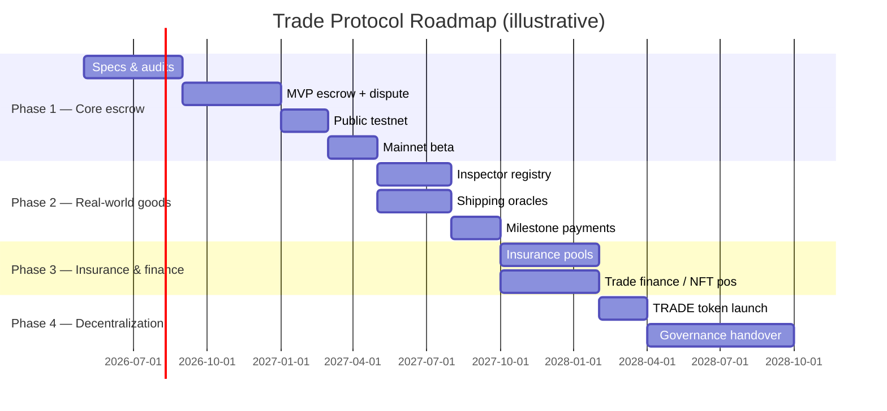

---
{"dg-publish":true,"permalink":"/docs/10-roadmap/","title":"10 — Roadmap","tags":["trade-protocol","roadmap"],"dg-note-properties":{"title":"10 — Roadmap","tags":["trade-protocol","roadmap"],"up":"[[README|Index]]","prev":"[[09-oracles-inspection-insurance]]"}}
---

# 10 — Roadmap

A pragmatic, phase-gated rollout. Each phase ends with a public milestone and
locks in the previous phase's contracts before adding scope.

## Phase 1 — Core escrow (months 0–12)

**Goal**: a trustworthy peer-to-peer escrow with dispute resolution.

- `EscrowFactory` + `EscrowInstance` (states: DRAFT … COMPLETED, plus DISPUTED).
- `DisputeCourt` v1 (jurors selected from a small accredited pool, not yet token-staked).
- Stablecoin settlement only (USDC).
- Off-chain UI; indexer; basic notifications.
- Bootstrapping admin multisig with pause & param-set.
- **Two professional audits** before mainnet beta.

Exit criteria: $X TVL through escrow with zero exploits over Y months;
dispute throughput tested with adversarial scenarios.

## Phase 2 — Real-world goods (months 12–18)

**Goal**: support a real container shipment, end to end.

- `ActorRegistry` + `AttestationHub`.
- Inspector accreditation flow + first 5–10 accredited inspectors (manual).
- Shipping oracle adapters for 1–2 major carriers / AIS providers.
- Milestone-payments hook.
- Pre-shipment inspection workflow (`04.2`).
- First insured pilot trades using **external** insurance (adapter to a
  licensed underwriter), not yet on-platform pools.

Exit criteria: 50 real international trades completed with PSI; zero
inspector slashings unwind incorrectly.

## Phase 3 — Insurance & finance (months 18–28)

**Goal**: bring insurance and trade finance on-platform.

- `InsurancePool` + first risk class (`MARINE_CARGO_A`).
- Surveyor accreditation; LP onboarding.
- `PositionNFT` for buyer position + secondary marketplace.
- Factoring / trade finance reference integration.
- Backstop fund seeded from treasury + accumulated fees.

Exit criteria: pool TVL > 5× max single-policy exposure; first claim paid
out cleanly; finance volume non-zero.

## Phase 4 — Decentralization (months 24–36)

**Goal**: progressively transfer control from admin multisig to TRADE
governance.

- TRADE token launch (community/airdrop/auction model TBD by phase 3).
- StakingVault live; juror pool migrates from accredited-only to
  TRADE-staked.
- Governor + timelock; parameter governance moves on-chain.
- Admin multisig role narrows to **emergency pause** only, then sunsets.

Exit criteria: governance has executed N parameter changes successfully;
admin multisig pause has not been used for 12 months; security council in
place as final backstop.

## Cross-phase: ongoing

- Continuous audits & a public bug-bounty program.
- Formal verification of the escrow state machine and the staking vault.
- Threat modeling exercises before each phase gate.
- Documentation kept in sync with the deployed code (these design docs are
  the *intent*; each release tags the deployed deltas).

## What we are deliberately not promising

- A specific launch date.
- A specific chain.
- A specific token launch mechanism.
- Coverage of regulated derivatives, securities, or sanctioned jurisdictions.

> [!warning] Why these are open
> These are decisions to be made with counsel, the community, and prevailing
> regulation at the time — not committed to in a design doc.

---

**See also:** [[docs/01-vision\|01-vision]] · [[docs/07-tokenomics\|07-tokenomics]] · [[docs/02-architecture\|02-architecture]]
